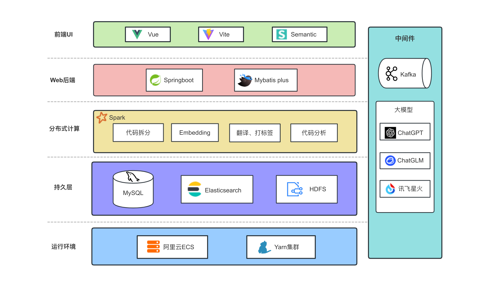
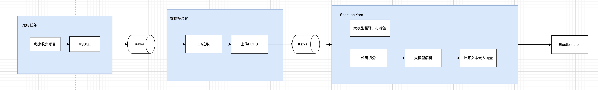

## 背景

Github 上有很多很好的开源项目可用于学习（~~做课设~~），但碍于 Github 对中文支持度低、搜索功能复杂难上手等问题，大多数人不能合适利用好 Github 的资源。我们希望可以为 Github 提供更好的搜索体验。

## 目标

- 支持简单搜索，搜索词可匹配到项目名称、README 等更多项目描述信息
- 深度翻译，提升中文体验
- 支持源码检索，为用户提供实用可靠的业务实例

## 技术选型

- HDFS：用于存储大量开源项目仓库。
- Yarn：资源调度，为 Spark 提供运行环境。
- MySQL：项目数据持久化。
- Kafka：分布式消息队列，可以解耦项目业务、收集项目日志等。通过重试机制提高业务（如 GPT 返回格式不正确）的可靠性。
- Elasticsearch：分布式搜索和数据分析引擎，可以完成文档(项目 README)查找、计算向量相似度等业务。
- Spark：项目数据分析的服务，调用接口完成文档翻译、打标签，代码拆分与解析等操作，最终入库 Elasticsearch。
- Python：爬虫收集 Github 项目列表等。
- 大模型：文档翻译、总结、打标签。
- 文本向量模型：计算文本嵌入向量。
- Springboot：构建后端服务。
- Vue+Vite：开发面向用户的 Web 端。

## 项目框架

## 实现思路

